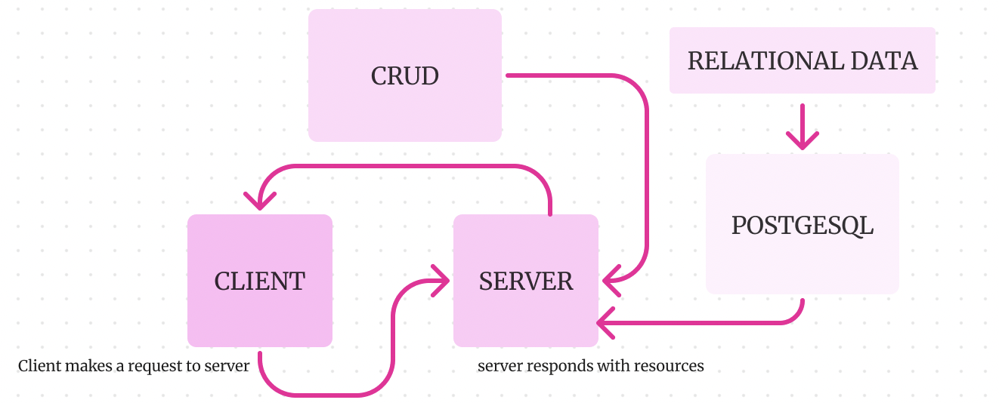

# api-server

### Author: Amanda Mendoza

### Version:1.0.0
### Overview
The project entails developing a RESTful API using Express.js and the Sequelize ORM to manage CRUD operations on a PostgreSQL database. We'll define Sequelize models that represent interrelated data, and these models will be exported as Node.js modules. For each model, we will create REST-compliant endpoints to handle CREATE, READ, UPDATE, and DELETE operations. At least one of these endpoints will fetch data spanning multiple tables. A Collection Class will be designed to manage these CRUD functionalities, utilizing relevant Sequelize methods for each action. Comprehensive error handling will be incorporated into the project. To complete the project, we will conduct extensive testing, document the API thoroughly, and prepare for possible deployment.

### UML

